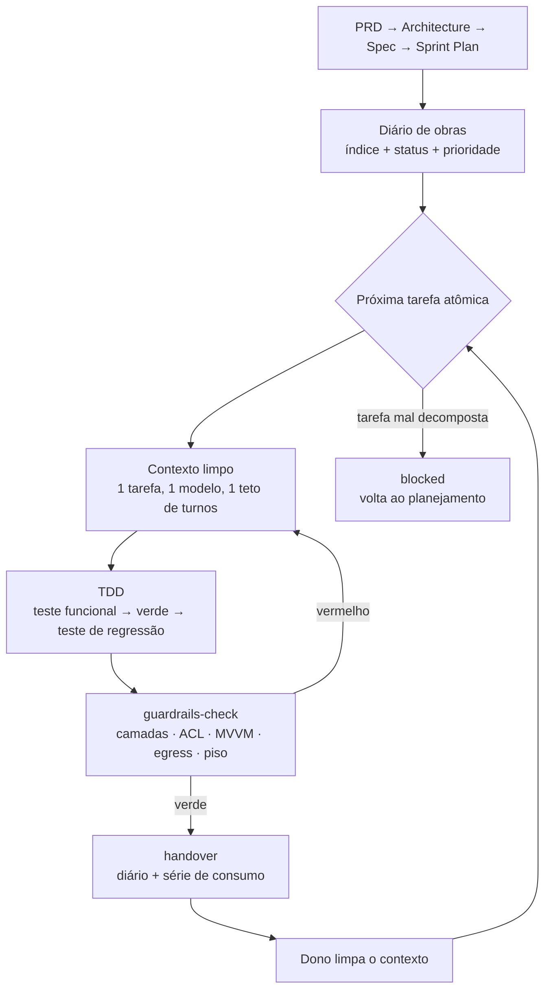

# PantonicApp — framework de governança e arquitetura para aplicações desktop construídas por agentes de IA

**Versão do framework:** `2.0.0` · **Idioma do corpus:** PT-BR · **Licença de uso:** repositório público de referência.

Este arquivo é um **espelho** da doutrina do framework: ele foi escrito para que uma pessoa leia
**um único arquivo** e consiga decidir se adota o PantonicApp, sem abrir nenhum outro documento.
Cada seção declara a sua **fonte da verdade** na primeira linha. Quando a doutrina muda, ela muda
na fonte e desce para cá — nunca o contrário (§12).

| § | Seção |
|---|---|
| 1 | O que é |
| 2 | Para quem é / para quem não é |
| 3 | As cinco premissas |
| 4 | A filosofia em seis escolhas |
| 5 | O modelo econômico |
| 6 | O ciclo de vida |
| 7 | Anatomia do kit |
| 8 | Os guardrails |
| 9 | Como adotar em 10 minutos |
| 10 | O que este framework não resolve |
| 11 | Decisões e o que as motivou |
| 12 | Versão, changelog e mapa dos documentos |
| 13 | Devo adotar? (FAQ de decisão) |

---

## 1. O que é

> Fonte da verdade: `GOVERNANCA.md` §1

O PantonicApp é um **framework de governança somada a arquitetura** para construir aplicações
desktop em Python com PySide6, quando quem escreve o código são agentes de IA e quem responde pelo
resultado é uma pessoa só. Ele não é uma biblioteca que você importa: é um conjunto de regras
sempre-ativas, um kit de agentes e skills prontos, e um punhado de verificações executáveis que
travam a entrega quando a regra é violada.

O problema que ele resolve não é "como escrever código Python". É o problema que aparece
**depois** de o código funcionar: agentes de IA produzem volume com facilidade e produzem *deriva*
com a mesma facilidade — camadas que se importam ao contrário, rotas abandonadas que continuam
testadas e verdes, planos que mudam de arquitetura no meio da execução porque o executor bateu num
obstáculo, e uma conta de uso que cresce sem ninguém saber qual tarefa a causou. Nada disso é
detectável olhando um diff. Todos são detectáveis por regra e por script.

A aposta central do framework é que **regra que não é executável não é regra, é intenção**. Onde
foi possível, cada princípio virou um teste, um check ou um gate que roda ao fim de toda tarefa.
Onde não foi possível, o princípio ficou escrito como item de revisão — e o próprio framework
registra que aquele item ainda é apenas texto, em vez de fingir que é enforcement. Este README é
honesto sobre essa distinção na §8, porque é ali que está a diferença entre o que o framework
garante e o que ele apenas recomenda.

## 2. Para quem é / para quem não é

> Fonte da verdade: `docs/plans/P-0729-v2-documentacao.md` §1

**Compensa quando o seu caso se parece com este:**

- Você é **uma pessoa ou um time muito pequeno** dirigindo agentes de IA, e o gargalo já não é
  escrever código — é manter coerência entre o que foi decidido e o que foi entregue.
- O projeto é **desktop, Python, com interface** — o stack para o qual toda a arquitetura foi
  desenhada e onde as regras foram medidas.
- Você **paga pelo uso dos modelos** e sente a diferença entre uma tarefa bem decomposta e uma
  sessão que arrastou contexto por quarenta turnos.
- Você pretende manter **mais de um projeto** com a mesma disciplina, e a ideia de reescrever a
  mesma governança em cada repositório já lhe parece errada.
- Você aceita que **decidir é caro e executar é barato**, e quer que essas duas fases não se
  misturem no mesmo contexto nem no mesmo modelo.

**Não compensa — e aqui a resposta honesta é "não adote":**

- **Projeto pequeno ou de vida curta.** O custo fixo do framework (quatro artefatos iniciais,
  diário de obras, gates) só se paga em trabalho que dura semanas. Para um script de duzentas
  linhas, ele é puro atrito.
- **Aplicação web, serviço de backend, biblioteca, mobile.** As camadas, os guardrails de MVVM e a
  regra de egress de filesystem foram desenhadas para desktop com Qt. Nada aqui foi validado fora
  disso.
- **Equipe grande com CI própria e code review humano estabelecido.** Boa parte do que o framework
  faz — travar entrega, provar que nada regrediu, registrar decisão — a sua organização já faz por
  processo. O framework passaria a ser uma segunda burocracia paralela.
- **Quem não paga por contexto** (uso ilimitado, orçamento irrelevante). Metade do valor do
  framework é economia de custo agêntico; sem essa dor, sobra a metade arquitetural, que você
  consegue com clean architecture comum.
- **Quem quer que o agente decida sozinho.** O framework foi construído para *impedir* isso. Se a
  sua expectativa é "o agente resolve", ele vai brigar com você em cada gate.

## 3. As cinco premissas

> Fonte da verdade: `GOVERNANCA.md` §1

Cinco premissas valem para todo projeto da família. Elas não são configuráveis — são o que define
um projeto como sendo "Pantonic".

1. **Desktop-first.** As aplicações são majoritariamente desktop. A decisão elimina de saída uma
   classe inteira de preocupações (sessão, multi-tenant, escalabilidade horizontal) e concentra o
   framework num alvo só.
2. **Stack fixo: Python + PySide6, arquitetura base MVVM.** Não há suporte a outro toolkit gráfico
   nem a outra linguagem. MVVM foi escolhido por ser o padrão apropriado para desktop com Qt.
3. **Obsessão por clean architecture e clean code — como guardrail, não como aspiração.** A
   diferença é operacional: um projeto que "valoriza qualidade" negocia sob pressão; um projeto com
   guardrail executável não consegue entregar violando a regra, porque o gate fica vermelho.
4. **Core comum reusável.** A camada de infraestrutura é a mesma em todos os projetos da família.
   Nenhum projeto reinventa infraestrutura; a especialização acontece nas camadas baixas (domínio e
   casos de uso), e quanto mais alto o nível, mais os projetos se parecem entre si.
5. **Extensibilidade exclusivamente por plugins.** Toda evolução funcional entra como plugin
   atômico, que se comunica com os demais apenas por sinais e estado — nunca por acoplamento
   direto. Não existe "adicionar um jeitinho no core".

## 4. A filosofia em seis escolhas

> Fonte da verdade: `GOVERNANCA.md` §3

Cada escolha aparece no mesmo formato: **o que foi escolhido → o que foi rejeitado → por quê → o
que isso custa**. Nenhuma delas é gratuita, e o custo está declarado.

**(a) Custo governado por fase de modelo**
Escolha: cada fase do trabalho roda no modelo adequado — planejamento no mais poderoso, execução no
melhor custo-benefício, varredura no mais barato — e essa tabela é **vinculante**, não preferência.
Rejeitado: usar o modelo mais forte em tudo, "por segurança".
Por quê: uma medição do próprio repositório registrou um executor rodando no modelo de planejamento
gastar 71 turnos e cerca de 189 mil tokens de contexto numa **única** tarefa atômica — algo em torno
de 30% do limite de cinco horas, por uma tarefa.
Custo: você precisa trocar de modelo no meio do trabalho, e o framework vai parar para pedir isso.
Um agente não troca o próprio modelo — só o dono troca.

**(b) Uma tarefa por contexto**
Escolha: cada tarefa atômica ocorre num contexto limpo e termina com handover; o contexto é
descartado antes da próxima.
Rejeitado: uma sessão longa que atravessa várias tarefas, acumulando conhecimento.
Por quê: contexto acumulado mistura escopo, degrada a qualidade da resposta e é reenviado inteiro a
cada turno — o mesmo material é pago repetidamente, com qualidade decrescente.
Custo: perde-se o "aquecimento". Cada tarefa recomeça fria, e o plano precisa ser bom o bastante
para que o executor não precise redescobrir nada. Se o plano for ruim, esta escolha dói.

**(c) Guardrail executável acima de convenção escrita**
Escolha: sempre que possível, a regra é um teste ou um script que falha; o que não pode ser
testado vira item explícito de revisão, marcado como tal.
Rejeitado: documento de boas práticas que todos concordam e ninguém verifica.
Por quê: convenção escrita não sobrevive à pressão de entrega nem à troca de contexto de um agente,
que não "lembra" da conversa de ontem.
Custo: escrever o check custa mais do que escrever a regra, e nem toda regra é automatizável — a
§8 mostra exatamente quais ainda são só texto.

**(d) Plugins acima de configuração**
Escolha: nova capacidade entra como plugin atômico, isolado, comunicando-se por sinais e por um
namespace de estado próprio.
Rejeitado: flags de configuração e ramos condicionais dentro do core.
Por quê: configuração multiplica os caminhos de execução sem multiplicar os testes; cada flag nova
dobra o espaço de estados que ninguém verifica.
Custo: mais cerimônia para uma funcionalidade pequena, e uma etapa obrigatória de prova de conceito
validada antes da integração.

**(e) TDD com piso de regressão comportamental**
Escolha: teste funcional primeiro, implementação até verde, teste de regressão trancando o
comportamento; o conjunto de comportamentos trancados é uma lista versionada que **nunca encolhe**
sem ato explícito do dono.
Rejeitado: percentual de cobertura como meta ou critério de pronto — proibido em todo o framework.
Por quê: percentual de cobertura premia manter teste de código morto para não derrubar a métrica,
que é exatamente o que outro guardrail proíbe. Escrito como comportamento, o piso reforça a
proibição em vez de contradizê-la.
Custo: manter a lista de comportamentos é trabalho manual, e remover um comportamento de propósito
exige registro do dono no mesmo commit — não dá para "limpar depois".

**(f) Hub único distribuído por git, em vez de cópia manual**
Escolha: agentes, skills e checks vivem num repositório-hub e chegam aos consumidores por
`git subtree`, com versão declarada e overrides locais explícitos.
Rejeitado: copiar a pasta de agentes para cada projeto novo.
Por quê: cópia manual diverge no primeiro dia útil e ninguém sabe qual cópia está certa. Com hub
único, existe uma versão canônica e a divergência é **detectável**.
Custo: o consumidor precisa entender `git subtree`, manter a árvore limpa para sincronizar, e
aceitar que a pasta do subtree não se edita à mão.

## 5. O modelo econômico

> Fonte da verdade: `GOVERNANCA.md` §3

O framework existe por causa de uma conta simples e frequentemente ignorada:

> **custo total ≈ Σ, por turno, de (tamanho do contexto reenviado × peso do modelo)**

Duas consequências que orientam quase tudo o que vem antes e depois:

**Número de turnos importa tanto quanto tamanho de contexto.** Um contexto de 100 mil tokens
reenviado em 40 turnos custa 40 reenvios. Reduzir o tamanho do contexto sem governar o número de
turnos deixa a maior alavanca solta. Daí três práticas obrigatórias: leituras e buscas independentes
vão **na mesma mensagem** (N leituras em 1 turno custam 1 reenvio; em N turnos, N); a suíte de
testes roda no máximo duas vezes por tarefa, nunca a cada micro-edição; e nunca se relê um arquivo
recém-editado "para conferir", porque a ferramenta de edição já falha ruidosamente.

**O contraintuitivo: delegar a um subagente é higiene de contexto, não economia de tokens.** O
subagente parte frio e paga de novo as instruções globais, a definição do próprio agente e as skills
carregadas — em *todos* os seus turnos. Ele protege o contexto do orquestrador, o que é valioso, mas
não reduz o consumo total. Tarefa pequena (abaixo de uns quinze turnos estimados) sai mais barata
executada inline do que delegada.

**Orçamento de turnos por classe de tarefa.** Cada tarefa atômica recebe um teto antes de ser
delegada, escolhido pela classe do trabalho e calibrado por uma série medida no próprio repositório
— nunca por estimativa:

| Classe de tarefa | Teto | Como reconhecer |
|---|---|---|
| Mecânica / pontual | ≤15 | um bloco de escrita, arquivos já conhecidos, sem contrato novo |
| Implementação padrão | ≤40 | vários blocos numa camada; contrato novo, verificação direta |
| Comportamental multi-camada | ≤60 | muda contrato ou fluxo; ciclo editar-rodar-depurar |
| Investigação / mapeamento | prescrito caso a caso | o entregável é descoberta, não mudança de código |
| Redação de doutrina / planejamento | ≤30 | o custo é decisão, não build |

A classe é registrada **antes** da delegação. Estourar o teto não é punição: é sinal de decomposição
errada, e obriga a replanejar em vez de continuar. Escolher uma classe mais generosa *depois* do
estouro é falsificar a série.

**A medição não é auto-relatada.** O consumo de cada tarefa é registrado por quem orquestra, lendo o
dado real da notificação de conclusão, numa série append-only. O motivo é medido: num caso
registrado, o auto-relato do próprio agente marcou cerca de 90 mil tokens contra cerca de 140 mil
reais — uma subestimativa de aproximadamente 35%. Um agente é uma testemunha ruim do próprio
consumo.

## 6. O ciclo de vida

> Fonte da verdade: `GOVERNANCA.md` §4

Um projeto nasce com quatro artefatos, produzidos nesta ordem pelo agente de planejamento: **PRD**
(objetivos, casos de uso, domínio, linguagem ubíqua) → **Architecture** (MVVM sobre clean
architecture, com cada responsabilidade rastreada a um caso de uso do PRD) → **Spec** (as classes
Python que materializam as responsabilidades: filesystem, assinaturas, docstrings, técnicas de
desacoplamento) → **Sprint Plan** (os checklists de tarefas atômicas, ordenados em fatias verticais
finas para que o dono consiga testar cedo).

A partir daí, o trabalho gira:



O **diário de obras** é o kanban central e o único registro canônico de uma tarefa. Tem um índice no
topo — uma linha por item, com ID, título, status e âncora — para que o executor ache o seu trabalho
sem ler seções alheias. Status possíveis: `backlog`, `in progress`, `in review`, `blocked`, `done`,
`cancelled`. Itens concluídos são condensados periodicamente para um histórico append-only.

**Como é uma tarefa atômica de verdade.** Uma tarefa bem escrita contém objetivo, arquivos-alvo com
caminho exato, contratos envolvidos, o comando de verificação copiado do terminal e o critério de
pronto. Exemplo real, executado neste repositório:

> **T15 — Receita executável de ratchet do piso** *(modelo: o de execução)*
> **Objetivo:** dar ao consumidor um comando que falha quando um comportamento sai do piso.
> **Arquivos-alvo:** `.claude/checks/ratchet_piso.py` (novo); entrada em
> `.claude/skills/guardrails-check/SKILL.md`.
> **Método:** o consumidor versiona `tests/piso_comportamental.txt`, uma linha por comportamento no
> formato `<pytest nodeid> — <comportamento em uma frase>`; o check compara essa lista com
> `pytest --collect-only -q` e falha quando um nodeid do piso desapareceu da coleta. Cobertura
> percentual não entra em nenhum ponto.
> **Verificação:** dois casos sintéticos — baseline casando a coleta (passa) e uma linha do piso
> apontando para nodeid inexistente (falha, nomeando o comportamento perdido).
> **Pronto quando:** o script e o formato existem; o gate o invoca; os dois casos conferem.

Note o que **não** está ali: nenhuma pergunta em aberto, nenhum "decidir na execução", nenhum ramo
condicional. Essa é a exigência formal — um plano com decisão pendente é recusado pelo executor
antes da primeira edição, porque decisão adiada acaba tomada no modelo mais barato e sem o contexto
de quem decidiu.

Quando o dono abre um contexto novo e diz apenas "execute o próximo passo", uma skill drena a fila
de planos, aplica a prioridade vigente registrada no diário (ou a heurística padrão: destravar
bloqueados → concluir o que está em andamento → bugs → o resto por ordem de chegada), escolhe **uma**
tarefa e delega.

## 7. Anatomia do kit

> Fonte da verdade: `.claude/README.md` §Agentes/Skills

O kit são nove agentes e nove skills que viajam juntos para todo projeto consumidor. O índice abaixo
é verificado por script contra o conteúdo real do diretório, nos dois sentidos.

**Agentes**

| Agente | Modelo | Quando dispara |
|---|---|---|
| `pantonic-planner` | Opus | Produzir os quatro artefatos ou decompor um procedimento complexo em tarefas atômicas. Não implementa. |
| `pantonic-executor` | Sonnet | Implementar **uma** tarefa atômica por contexto, com TDD e guardrails. Não replaneja escopo. |
| `pantonic-scout` | Haiku | Buscas, greps e leitura de codebase/documentos; devolve dossiê compacto para preservar o contexto dos caros. |
| `pantonic-auditor-arch` | Opus | Auditoria de clean architecture: checklist de desvios de camada com ações de recuperação. Não altera código. |
| `pantonic-auditor-cleancode` | Sonnet | Auditoria de clean code: code smells, coesão e acoplamento. Não altera código. |
| `pantonic-auditor-pyside6` | Sonnet | Auditoria do uso de Qt: threading, signals/slots, ownership, layouts, model/view, performance. |
| `pantonic-auditor-container` | Sonnet | Auditoria de empacotamento e runtime de container: Dockerfile, 12-factor, event loop, shutdown, observabilidade. |
| `pantonic-fora-da-caixa` | Opus | Varrer procedimentos que ficaram complexos por acúmulo e propor o redesenho "como se recomeçasse hoje". |
| `pantonic-benchmarker` | Haiku | Produzir, a partir de um repositório público confirmado, um relatório de benchmarking em esquema fixo de 16 dimensões. |

**Skills**

| Skill | Quando dispara |
|---|---|
| `bootstrap-pantonic` | Criar um projeto novo da família — os quatro artefatos, a estrutura de docs e o esqueleto do core. |
| `diario-de-obras` | Registrar plano novo, abrir tíquete avulso, mudar status ou condensar itens concluídos. |
| `proximo-passo` | Contexto novo pedindo "siga o backlog": drena a fila de planos, escolhe uma tarefa e delega. |
| `handover` | Fechar, bloquear ou interromper qualquer tarefa; atualiza o diário e prepara a troca de contexto. |
| `guardrails-check` | Antes de marcar qualquer tarefa como concluída: camadas, ACL, MVVM, egress, namespace de estado, conformance, piso. |
| `integrar-poc` | Uma prova de conceito foi validada e precisa virar plugin, dissecada nas camadas da arquitetura. |
| `modelo-por-fase` | Início de tarefa ou troca de fase: confere o modelo ativo contra a tabela vinculante e para para pedir o correto. |
| `checar-versao-kit` | Criação de um plano novo: compara a versão local do kit com a publicada no hub — e nunca atualiza sozinha. |
| `audit-sweep` | Antes de invocar qualquer auditor: roda a fase mecânica de greps no modelo barato e grava o dossiê. |

Skills de uso pessoal instaladas fora do repositório (por exemplo, rotinas de onboarding ou de
preparação de contexto do próprio dono) **não** fazem parte do kit e não viajam para o consumidor.
Regra que só existe fora do repositório não chega a consumidor nenhum e, por isso, não conta como
doutrina do framework.

## 8. Os guardrails

> Fonte da verdade: `GOVERNANCA.md` §7

Quatorze regras mínimas obrigatórias. A coluna do meio é a parte honesta desta seção: distingue o
que **falha por si** do que ainda depende de alguém ler um checklist.

| # | Regra | Como é enforceada |
|---|---|---|
| 1 | Regra de dependência inviolável: `infracore ← contracts ← services ← plugins`, nunca no inverso | **Teste executável** (conformance, análise AST de imports) |
| 2 | ACL: toda dependência externa pertence a exatamente um serviço; nenhum outro módulo a importa | **Teste executável** (conformance) |
| 3 | MVVM estrito: geometria/estilo Qt só na shell e Views; ViewModel sem widgets; Model sem Qt | **Teste executável** (conformance) |
| 4 | Egress único de filesystem: só o componente de filesystem escreve em disco | **Teste executável** (AST) |
| 5 | Namespace de estado: plugin só escreve em `plugins.<nome>.*`, salvo whitelist explícita | **Teste executável** (boundary) |
| 6 | Gate de conformance: nenhuma tarefa é `done` com conformance vermelho | **Teste executável** (bloqueante) |
| 7 | Piso de regressão nunca desce; remoção intencional exige registro de decisão | **Teste executável** (check de ratchet contra a lista versionada) |
| 8 | Disciplina de contexto: uma tarefa por contexto; varredura ampla só via agente de coleta; doc grande via índice | **Instrução de agente** |
| 9 | `G-DEADCODE`: todo símbolo de produção precisa de ao menos um chamador de produção alcançável; rota abandonada morre no mesmo commit | **Teste executável** (alcançabilidade por AST) + **gate de review** no handover |
| 10 | `G-PLANFIDELITY`: o executor não substitui a rota arquitetural aprovada por alternativa própria sob pressão técnica | **Gate de review** (o handover confirma que não houve bifurcação sem decision record) |
| 11 | `G-PREMISE`: premissa que embasa abandono de rota exige spike que a comprove, não asserção | **Gate de review** no fechamento da tarefa que abandona ou bifurca |
| 12 | `G-PLANREADY`: plano só é publicável fechado — id sequencial, tarefas ordenadas, decisões todas tomadas, linear, sem vão | **Gate de review** (checklist de 5 condições, verificado ao registrar o plano) |
| 13 | `G-EXECREADY`: o executor não decide, não pergunta ao dono e recusa performar plano não-pronto | **Instrução de agente** + **gate de review** |
| 14 | Allowlist de subcomandos destrutivos: reescrita de histórico, descarte de trabalho não commitado e remoção de branch/repo ficam negados | **Enforcement de permissão** (lista de negação nas configurações, falha ruidosa) |

Cinco dos quatorze são **apenas** instrução de agente ou gate de review — ou seja, dependem de o
agente obedecer ao que está escrito e de alguém conferir no fechamento. O framework não esconde
isso: uma regra que não pode virar script nasce com o motivo escrito de por que não pode.

## 9. Como adotar em 10 minutos

> Fonte da verdade: `GOVERNANCA.md` §9

Pré-requisitos: o projeto consumidor precisa ser um **repositório git** com a **árvore limpa** —
`git subtree` exige as duas coisas, e essa foi a premissa que mais derrubou plano nesta iniciativa.

**1. Instalar o kit como subtree** (uma vez, no repositório do consumidor):

```
git subtree add --prefix=.claude/kit <URL-do-hub> kit --squash
```

Isso traz agentes, skills e checks para `.claude/kit/`, com histórico próprio e reversível por
`git revert` do commit de instalação.

**2. Aplicar a versão publicada sobre a árvore local:**

```
pwsh .claude/kit/sync-kit.ps1
```

O script aplica os artefatos do kit por cima do `.claude/` do projeto, respeitando os overrides
declarados em `kit-exclude.txt`, e grava um carimbo de sincronização com a versão recebida.

**3. Declarar os seus overrides.** `kit-exclude.txt` é a lista de artefatos em que a sua versão
local vence a do hub. Ela é a única maneira legítima de divergir do kit — divergência não declarada
é apagada no próximo sync, e é para isso que a lista serve.

**4. Ajustar os "fatos estáveis" dos agentes.** Cada arquivo de agente tem um bloco de fatos
estáveis do projeto: caminhos reais, nomes de camadas, localização da suíte de testes. **Isso** é o
que você personaliza.

**5. Verificar:**

```
pwsh .claude/checks/kit_check.ps1 -Mode validate
pwsh .claude/checks/kit_check.ps1 -Mode check-drift
```

O primeiro valida a estrutura do kit e a paridade de versão; o segundo compara o índice derivado com
o conteúdo real do disco.

**O que você nunca deve tocar:** o conteúdo de `.claude/kit/` à mão. Ele vem do hub e será
sobrescrito. Quer mudar algo do kit? Muda no hub e sincroniza, ou declara override em
`kit-exclude.txt`.

**Como você descobre que a sua cópia está desatualizada:** ao criar um plano novo, uma skill compara
a versão local com a publicada no hub, com uma única chamada de rede que não faz fetch nem toca a sua
árvore de trabalho. Versões iguais → segue em silêncio. Divergência em MINOR ou PATCH → reporta as
duas versões e pergunta se atualiza agora ou posterga. Divergência em MAJOR → reporta como
**incompatível** e para. Sem rede → reporta "não verificado" e segue, sem fingir que estava tudo bem.

**Limite inviolável:** nenhum agente sincroniza o kit por conta própria, em nenhuma circunstância —
nem quando a divergência parece ser "só um patch". Detectar a divergência e agir sobre ela são atos
distintos. Não existe nível de severidade que justifique pular essa separação.

## 10. O que este framework não resolve

> Fonte da verdade: `docs/plans/P-0729-v2-documentacao.md` §1

Lista deliberada do que ele **não** faz, para que a decisão de adotar seja tomada com o custo à
vista:

- **Não é CI/CD.** Não há pipeline, não há build reproduzível, não há deploy, não há matriz de
  ambientes. Os checks rodam onde o agente roda — na sua máquina, quando alguém os invoca.
- **Não gerencia equipe.** Não há papéis humanos, atribuição, permissões, revisão por pares nem
  resolução de conflito entre pessoas. O modelo mental é de um dono decidindo e agentes executando.
- **Não substitui revisão humana.** Vários guardrails são gates de review — alguém tem de olhar.
  Um projeto em que ninguém lê o handover tem cinco das quatorze regras funcionando no papel apenas.
- **Não impede custo alto se o dono ignorar os gates.** O framework para e pede troca de modelo,
  reporta estouro de teto e recusa plano aberto. Se o dono aprovar tudo sem ler, o custo volta a
  subir e o framework terá servido para documentar o desperdício, não para evitá-lo.
- **Não foi validado fora do stack desktop Python com Qt.** Não há evidência de que os guardrails
  de camada façam sentido em web ou em backend; a hipótese é plausível e permanece **não testada**.
- **Não tem base de adoção.** Hoje existe **um** consumidor real do kit. As regras foram calibradas
  por uma série medida em algumas dezenas de tarefas, num único ambiente, com um único dono. É
  evidência real, mas é amostra pequena — e amostra pequena de um usuário só tem viés.
- **Não é estável em API.** A doutrina ainda muda em ritmo de MINOR frequente. Adotar hoje significa
  acompanhar mudanças de regra, não apenas de código.
- **Não roda em qualquer sistema operacional sem atrito.** Os checks e o sincronizador são scripts
  PowerShell, escritos e exercitados no Windows.

## 11. Decisões e o que as motivou

> Fonte da verdade: `GOVERNANCA.md` §3

Cada regra deste framework nasceu de um erro medido, não de uma preferência estética. Cinco
exemplos, com a evidência que os produziu:

| Decisão | Evidência que a produziu |
|---|---|
| **Modelo por fase é vinculante** — a tabela de modelos não pode ser invertida por preferência do dono, e trocar o modelo de um executor exige OK explícito registrado | Um executor rodando no modelo de planejamento consumiu **71 turnos e ~189 mil tokens de contexto numa única tarefa atômica** — cerca de 30% do limite de cinco horas, gasto numa tarefa só. |
| **`G-DEADCODE`: código morto testado é proibido; rota abandonada morre no mesmo commit** | Um episódio real num projeto consumidor deixou **~300 linhas de produção sem nenhum chamador**, vivas apenas porque dois arquivos de teste as exercitavam. Dois módulos, 174 e 127 linhas, de uma rota construída num plano e abandonada no plano seguinte, sem remoção. A suíte estava verde o tempo todo — foi exatamente a suíte verde que **mascarou** o problema, e o código passou por revisão humana assim mesmo. |
| **Decisão que escolhe mecanismo de plataforma exige sonda de viabilidade junto da recomendação, não depois** | Numa única iniciativa, **três premissas de plataforma caíram** por sondagem curta demais: o mecanismo escolhido para compartilhar arquivos entre repositórios (**symlink de arquivo**) exigia **privilégio elevado no Windows**; os projetos-filho **não eram repositórios git**, o que `git subtree` exige; e os filhos **já tinham cópia manual** dos documentos de doutrina. Cada uma custou retrabalho de plano que uma sonda de um ou dois comandos, feita antes da recomendação, teria evitado. |
| **Um plano que absorve fase de outro mapeia tarefa a tarefa, nunca fase a fase** | "A fase X foi absorvida pela fase Y" é afirmação numa granularidade mais grossa que o objeto afirmado. Medido: uma fase de quatro tarefas se espalhou por duas fases do plano sucessor e **uma tarefa não caiu em nenhuma das duas** — só apareceu quando um passo posterior tentou consumir o insumo e ele não existia. |
| **Telemetria vem da medição, nunca do auto-relato do agente** | Num caso registrado, o auto-relato do próprio agente marcou **~90 mil tokens contra ~140 mil reais** — subestimativa de aproximadamente 35%. |
| **Teto de turnos graduado por classe, calibrado pela série medida** | O teto único anterior tratava naturezas diferentes como se custassem o mesmo. Ao calibrar a classe de redação de doutrina, a estimativa inicial de ≤25 turnos foi **contrariada pela série**: de sete tarefas medidas, cinco estouravam ≤25 e apenas duas estouravam ≤30. Quando série medida e estimativa divergem, manda a série. |

O padrão comum é o que separa este framework de uma lista de boas intenções: **nenhuma dessas regras
existe porque pareceu uma boa ideia.** Cada uma tem um número, uma data e um incidente atrás dela — e
quando um número novo contradiz a regra, é a regra que muda.

## 12. Versão, changelog e mapa dos documentos

> Fonte da verdade: `CHANGELOG.md` §2.0.0

**Versão vigente do framework: `2.0.0`.** O mesmo número vive em `VERSION` (raiz) e em
`.claude/KIT_VERSION` (dentro do prefixo que o subtree publica), e os dois precisam coincidir — é
uma das coisas que o check de kit verifica. O versionamento é semântico com significado declarado:
**MAJOR** exige ação do consumidor, **MINOR** adiciona artefato ou guardrail compatível, **PATCH**
corrige redação.

O que entrou na `2.0.0` (2026-08-05, MAJOR — fecha a iniciativa `PANTONIC-V2`): este `README.md`
canônico (13 seções, espelho com fonte declarada por seção) e o guarda executável
`.claude/checks/check-readme.ps1` que o trava contra drift; `docs/DOC_MAP.md` confirmado como porta
de entrada dos documentos grandes do hub; somados os 14 guardrails de `GOVERNANCA.md` §7 e os
artefatos de enforcement acumulados desde a `1.1.0` (ver seções abaixo por MINOR). Justificativa do
MAJOR e nota de migração ao consumidor: `CHANGELOG.md` §2.0.0.

**Regra anti-drift deste README.** Este arquivo é **espelho, não fonte**. Doutrina se edita no
documento-fonte declarado no topo de cada seção e **desce** para cá no mesmo trabalho; editar a
doutrina aqui e deixar a fonte para trás cria um terceiro documento normativo que diverge na
primeira mudança. Um check mecânico compara este README com o disco — contagem de agentes, de
skills, de guardrails, e a versão citada acima — e falha quando o espelho envelhece.

**Quer saber X? O arquivo é Y:**

| Se você quer... | Arquivo |
|---|---|
| A doutrina normativa completa: identidade, camadas, operações agênticas, fluxo, guardrails, versionamento | `GOVERNANCA.md` |
| A arquitetura reusável: core pantonico, camadas, regras de integração | `ARQUITETURA_PANTONICA.md` |
| O índice de agentes e skills do kit, derivado do disco | `.claude/README.md` |
| O histórico de mudanças do framework, versão a versão | `CHANGELOG.md` |
| A versão vigente, em número | `VERSION` e `.claude/KIT_VERSION` |
| O estado de trabalho corrente: tarefas, status, prioridade vigente | `docs/DIARIO_DE_OBRAS.md` |
| O histórico condensado de tarefas já fechadas | `docs/DIARIO_HISTORICO.md` |
| Como navegar os documentos grandes sem lê-los inteiros | `docs/DOC_MAP.md` |
| A série medida de consumo por tarefa | `docs/telemetria.tsv` |
| Quais projetos consomem o kit e em que versão | `docs/CONSUMIDORES.md` |
| O raciocínio por trás de uma decisão específica, com o incidente que a originou | `docs/plans/` |

## 13. Devo adotar? (FAQ de decisão)

> Fonte da verdade: `docs/plans/P-0729-v2-documentacao.md` §2

**1. O que este framework faz por mim que eu não teria de graça?**
Três coisas. Impede que a arquitetura seja violada em silêncio, por script e não por combinado.
Impede que uma decisão cara seja tomada pelo modelo barato no meio da execução. E dá a você uma
série medida do próprio custo agêntico, tarefa a tarefa, para que "está caro" vire um número. Um
projeto disciplinado consegue as três na mão; o framework as torna difíceis de esquecer.

**2. Em que tipo de projeto ele seria um erro?**
Projeto pequeno ou de vida curta, qualquer coisa que não seja desktop Python com Qt, e times com CI
e revisão por pares já estabelecidas. Nesses casos, **não adote**: o custo fixo dos quatro artefatos,
do diário e dos gates não se paga, e você vai acabar com uma segunda burocracia paralela à que já
funciona.

**3. Quanto ele me custa — em disciplina e em dinheiro?**
Em disciplina, bastante: uma tarefa por contexto (nada de sessões longas confortáveis), plano
fechado antes de executar (nada de "decido no caminho"), teste funcional antes da implementação, e o
hábito de trocar de modelo quando o framework pede. Em dinheiro, ele **reduz** o custo agêntico
comparado a rodar tudo no modelo mais forte — mas cobra adiantado, porque a fase de planejamento
usa o modelo caro de propósito. Se você não estava planejando antes, a sua conta de planejamento
sobe; a de execução cai mais.

**4. Qual a primeira coisa que eu faço, e a primeira que eu quebro se fizer errado?**
Primeira: instalar o kit por `git subtree` num repositório de árvore limpa e declarar os seus
overrides em `kit-exclude.txt`. Primeira coisa que você quebra: editar à mão os arquivos dentro de
`.claude/kit/`. Eles vêm do hub, o próximo sync os sobrescreve, e você perde a edição sem aviso —
é exatamente por isso que a lista de overrides existe.

**5. O que ele deliberadamente recusa a fazer, e por quê?**
Recusa deixar o agente decidir arquitetura ou requisitos — porque decisão adiada acaba tomada no
modelo mais barato e sem o contexto de quem decidiu. Recusa que um agente atualize o kit sozinho —
porque detectar divergência e agir sobre ela são atos distintos, e a separação não tem exceção de
severidade. Recusa percentual de cobertura como meta — porque isso premia manter teste de código
morto. E recusa comando destrutivo de git como decisão de agente — reescrita de histórico e descarte
de trabalho não commitado ficam negados na configuração, com falha ruidosa.

**6. Devo adotar se eu quero um framework maduro, com comunidade e casos de uso variados?**
**Não.** Hoje há um único consumidor real do kit, um único dono, um único sistema operacional
exercitado e uma amostra de algumas dezenas de tarefas medidas. As regras são bem fundamentadas
para o contexto em que nasceram e permanecem não testadas fora dele. Se você precisa de maturidade
de ecossistema, este não é o lugar — se você quer um conjunto pequeno de regras que já provaram
pegar erros reais, e topa adaptá-lo, é.
